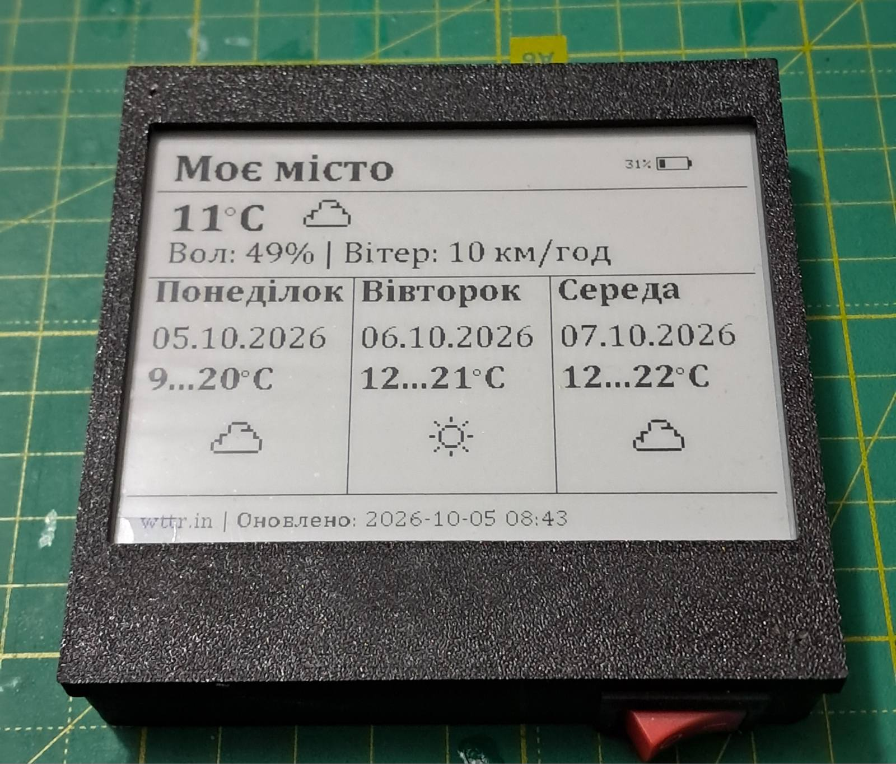

# ESP32 E-Paper Weather Gadget

A compact battery-powered **magnetic weather display designed for mounting on a refrigerator**, based on an ESP32-C3 SuperMini and a 4.2-inch E-Paper screen.

The device connects to Wi-Fi, retrieves current weather conditions and a three-day forecast from [wttr.in](https://wttr.in), displays the information in Ukrainian, and then enters deep sleep to reduce power consumption.



## Features

- Current temperature
- Relative humidity
- Wind speed
- Three-day weather forecast
- Daily minimum and maximum temperatures
- Graphical weather condition icons
- Ukrainian-language user interface
- Current date and weekday
- Battery level indication
- Last weather update timestamp
- NTP time synchronization
- Wi-Fi configuration through a built-in web interface
- Persistent Wi-Fi settings stored in ESP32 Preferences
- Automatic weather updates every 30 minutes
- Deep sleep between updates
- Custom Cyrillic fonts
- 3D-printed magnetic enclosure for refrigerator mounting

## Hardware

The current version of the gadget uses:

- **ESP32-C3 SuperMini**
- **4.2" GDEY042T81 E-Paper display**, 400 × 300 pixels
- **Li-Ion battery**
- **TP4056** Li-Ion charging module
- Resistor divider for battery voltage measurement
- 3D-printed enclosure with magnets

Battery voltage is measured using an ESP32 ADC input and displayed as an approximate battery charge percentage.

## How It Works

After startup or waking from deep sleep, the ESP32:

1. Loads the stored Wi-Fi configuration.
2. Connects to the configured Wi-Fi network.
3. Synchronizes the system clock using NTP.
4. Requests weather information from wttr.in.
5. Parses the received weather data.
6. Measures the battery voltage.
7. Renders the current weather and three-day forecast on the E-Paper display.
8. Disconnects from Wi-Fi.
9. Enters deep sleep.
10. Wakes up approximately 30 minutes later to refresh the information.

Because the E-Paper display retains its image without continuous power, the weather information remains visible while the ESP32 is sleeping.

## Weather Data

Weather information is retrieved from **wttr.in**.

The location is currently configured directly in the firmware:

```cpp
const String LOCATION = "50.450,30.523";
```

These coordinates point to **Kyiv, Ukraine**.

To use the gadget for another location, change `LOCATION` before compiling and uploading the firmware.

## Wi-Fi Configuration

Wi-Fi credentials do not need to be hard-coded into the firmware.

If Wi-Fi configuration is required, the gadget can start its own configuration access point.

Connect to:

```text
Weather-Gadget-Setup
```

Then open:

```text
http://192.168.4.1
```

in a web browser and enter the Wi-Fi credentials.

The credentials are stored using the ESP32 Preferences storage.

> **Note:** The configuration access point is intended for local initial setup and is not password protected.

## Arduino IDE Configuration

The project targets the **ESP32-C3 SuperMini**.

Before compiling and uploading the firmware, configure the following Arduino IDE options:

|     Setting      |      Value     |
|------------------|----------------|
| USB CDC On Boot  | **Enabled**    |
| Partition Scheme | **Huge APP**   |
| Flash Size       | **4MB (32Mb)** |

These settings are required for the current firmware configuration.

## Software and Libraries

The firmware is written in **C++ using the Arduino framework**.

The project uses the following libraries and ESP32 components:

- **GxEPD2** — E-Paper display support
- **ArduinoJson** — JSON parsing
- **WiFi** — ESP32 Wi-Fi connectivity
- **HTTPClient** — weather requests
- **WebServer** — Wi-Fi configuration interface
- **DNSServer** — local configuration portal
- **Preferences** — persistent Wi-Fi configuration
- ESP32 deep sleep API
- NTP time synchronization

Custom fonts included in the repository provide Cyrillic characters for the Ukrainian interface.

## Display

The user interface is designed for a **400 × 300 monochrome E-Paper display**.

It shows:

- Location name
- Battery percentage
- Current temperature
- Current weather icon
- Humidity
- Wind speed
- Three-day forecast
- Minimum and maximum temperatures
- Forecast weather icons
- Date and weekday
- Weather data source
- Last successful update time

## Project Structure

```text
esp32-epaper-weather-gadget/
├── docs/
│   └── images/
│       └── weather-gadget.jpg
├── fonts/
├── src/
│   ├── enums/
│   └── helpers/
├── CyrillicFonts.h
├── UkrFont.h
├── utils.cpp
├── utils.h
├── weather_gdget.ino
├── .gitignore
└── README.md
```

## Known Limitations

This repository contains the current working version of a personal DIY project and is not under active development.

Known limitations include:

- The weather location is configured directly in the source code.
- Weather requests currently use HTTP rather than HTTPS.
- The Wi-Fi configuration access point is not password protected.
- Wi-Fi credentials are entered through a local unencrypted configuration page.
- Battery voltage calculation uses hardware-specific calibration.
- Some Wi-Fi failure/deep-sleep scenarios may require a manual restart.

## Project Status

**Completed DIY project.**

The gadget is functional and is currently used as a battery-powered magnetic weather display.

The source code is published as a reference project and portfolio example. No active feature development is currently planned.